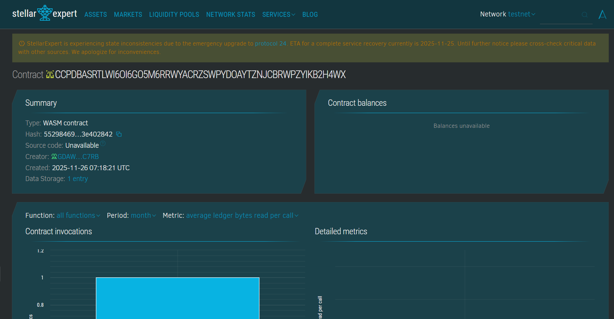

# ProofOfTime Contract

## Project Title
ProofOfTime Contract

## Project Description
ProofOfTime Contract is a blockchain-based work time logging and payment validation system. Built using Soroban smart contracts on Stellar, it securely records worker project times, verifies logged hours by authorized entities, and links verified times to payment calculations ensuring transparency and fairness.

## Project Vision
This project addresses the need for trustworthy and immutable work time tracking that directly ties labor durations to compensation. ProofOfTime Contract eliminates disputes, enforces transparency, and builds trust between workers, managers, and payers by ensuring immutable records on blockchain.

## Key Features
- Work Time Logs: Secure and accurate log creation for project hours.
- Verification Layer: Authorized parties verify logs before payment.
- Payment Calculation: Automated calculations based on logged hours and rates.
- Immutable Records: Tamper-proof data storage on blockchain.
- Authorization and Access: Roles enforced to protect log integrity.
- Query Support: Retrieve logs and payment details transparently.

## Usage Instructions
1. Workers log work time specifying project and timing.
2. Managers verify logged times.
3. Payment calculated according to verified times and rates.
4. Logs and payments can be audited anytime on-chain.

## Future Scope
- Integration with biometric or IoT for automatic time capture.
- Support batch log submissions and payroll instructions.
- Multi-currency payment calculation and disbursement.
- Dispute resolution through decentralized arbitration.
- Mobile and web portals for ease of access.
- Analytics on labor efficiency and compliance.

## Technology Stack
- Soroban SDK in Rust for robust smart contracts.
- Stellar blockchain for decentralized, immutable storage.
- Cryptographic verification ensuring authenticity and authorization.

## Contribution
Open to developers, HR systems experts, and blockchain auditors to enhance features, security, and usability. Contributions via forks and pull requests welcome.

## License
This project is licensed under the MIT License.

### Contract Detail
ID : CCPDBASRTLWI6OI6GO5M6RRWYACRZSWPYDOAYTZNJCBRWPZYIKB2H4WX
